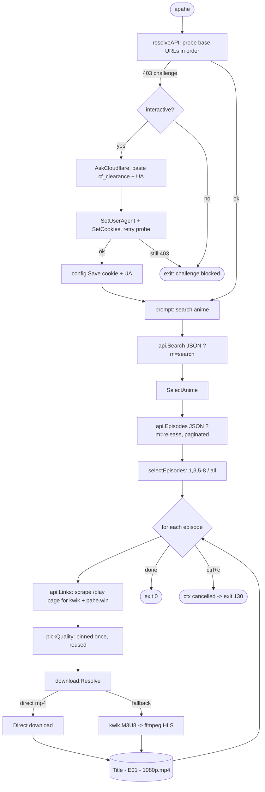

# Architecture

`apahe` searches AnimePahe and downloads episodes as a single static Go binary.
The only runtime dependency is **ffmpeg** (on `PATH`), used for the HLS download
path. This doc explains how the pieces fit; package-level detail lives in the
source and in [`CLAUDE.md`](../CLAUDE.md).

## End-to-end flow

The orchestration lives in `internal/app` (`Run`). It probes for a live base
URL (clearing any Cloudflare challenge first), prompts for a search, lists
episodes, pins a quality, then resolves and downloads each episode.

## Packages

| Package | Responsibility |
| --- | --- |
| `internal/client` | Cloudflare-aware HTTP over `bogdanfinn/tls-client`. Picks the TLS/JA3 profile from the User-Agent's browser family (Firefox vs Chrome) — a mismatch trips CF on cookieless hosts. Holds redirect-following and non-following clients on one cookie jar. |
| `internal/animepahe` | Search + release JSON endpoints. No links API — `Links` scrapes the `/play/{anime}/{ep}` page for kwik embeds and pahe.win anchors. Every request sends `Referer` + `X-Requested-With`. |
| `internal/kwik` | Resolves kwik.cx links. `unpack.go` reverses Dean-Edwards `p,a,c,k,e,d` JS (the unit-tested core); `resolve.go` scans **all** packed blocks because the `.m3u8` lives in a later one. |
| `internal/download` | `Resolve` tries direct mp4, falls back to HLS. `hls.go` shells to ffmpeg with a **kwik** referer (the owocdn stream host gates on it). AES-128 keys are fetched by ffmpeg itself. |
| `internal/app` | Wires it together: probe, prompts, episode/quality selection, retry, ctrl+c handling. |
| `internal/config` | Precedence highest-first: flag > env > JSON file (`~/.config/animepahe-dl/config.json`, 0600) > defaults. |

## Cloudflare constraint

Base domains **rotate** and the site runs Cloudflare's managed JS challenge
(`cf-mitigated: challenge`). TLS spoofing alone cannot pass it. The workaround is
a browser-harvested `cf_clearance` cookie + matching User-Agent (cf_clearance is
bound to IP+UA), supplied via the interactive prompt (auto-saved) or
`--cookie`/`--user-agent`/env/config. kwik.cx and the owocdn stream host add
their own referer gates.

## Interrupt handling

`main.go` installs `signal.NotifyContext(os.Interrupt)` and threads the context
through `app.Run` into the download layer. ctrl+c at a prompt returns
`survey/terminal.InterruptErr`; ctrl+c mid-download cancels the context (ffmpeg
runs under `exec.CommandContext`, the direct path closes its body via
`context.AfterFunc`). Either way the process exits **130** silently — no
`error:` line, no per-episode failure spam.
